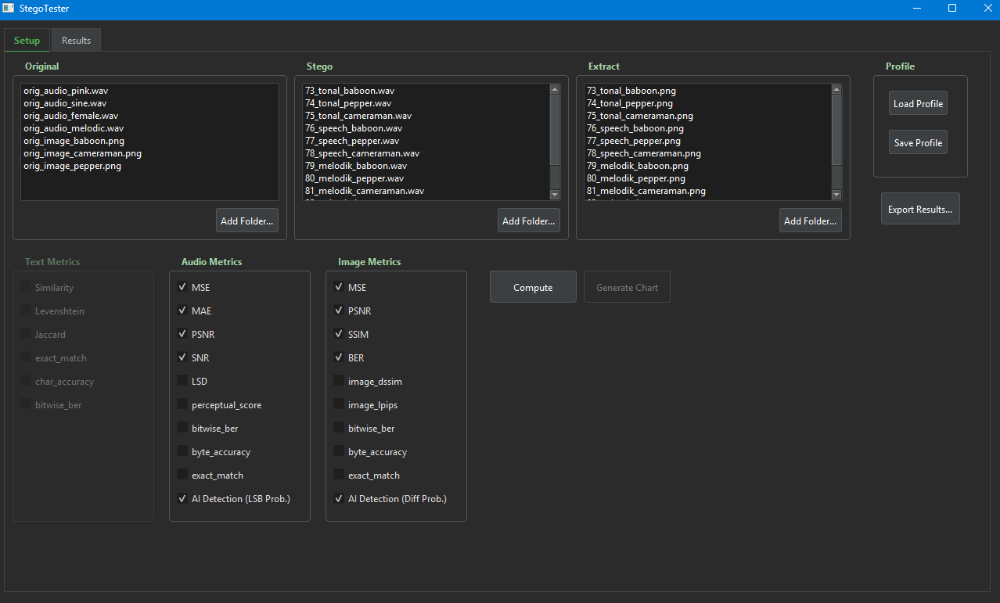
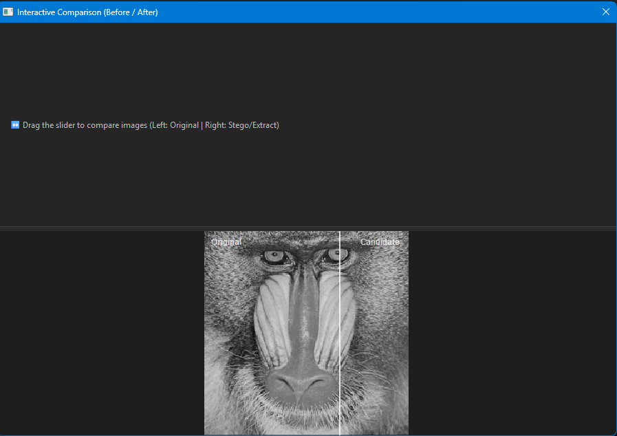
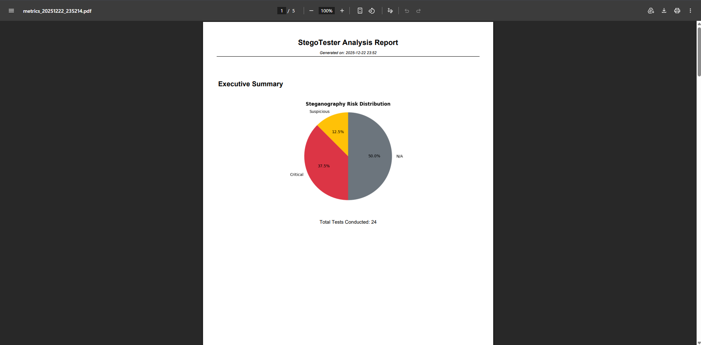

# StegoTester v3.0 AI

**Next-Gen Steganography Analysis & Detection Tool with AI-Powered Matching**

[](https://www.python.org/)
[](https://www.qt.io/qt-for-python)
[](https://opensource.org/licenses/MIT)
[]()

**StegoTester v3.0** is a professional-grade desktop application designed for researchers and cyber-security analysts. It goes beyond simple metric calculation by introducing **Smart Content Matching** and **Statistical Steganalysis (AI Detection)** to identify hidden data in Image and Audio files.

Completely rewritten with a modern "Cyber-Security Workbench" interface, it eliminates the need for strict file naming conventions and provides deep insights into steganographic quality and detectability.



## 🚀 What's New in v3.0?

* **🧠 AI Steganalysis (Detection):**
    * **Images:** Uses *Differential LSB Entropy Analysis* to calculate the probability of hidden data based on pixel residuals.
    * **Audio:** Uses *Coverage Density Analysis* designed to detect advanced Spread Spectrum and Vector Embedding techniques that traditional amplitude checks miss.
* **🔍 Smart Matching (No More Regex):**
    * Forget about renaming files! StegoTester now uses **Perceptual Hashing (pHash)** for images and **Audio Fingerprinting (FFT Spectrum)** for sound files to automatically pair original files with their steganographic counterparts, even if filenames are completely different.
* **🎨 Modern Dark UI:** A custom-built Fusion theme with a minimalist dark grey and soft green palette, optimized for long working sessions.
* **↔️ Interactive Comparison:** A new **Before/After Slider** tool to visually inspect pixel-level artifacts in real-time.
* **📊 Professional Reporting:** Generates PDF reports with **Executive Summaries**, **Risk Pie Charts**, and color-coded verdict badges (Safe/Suspicious/Critical).

## Key Features

### 1. Smart & Content-Aware Workflow
Just drag and drop your folders. The engine analyzes the *content* of the files to match them.
* *Example:* `baboon.png` (Original) will automatically match with `encrypted_payload_v2.png` (Stego) because they look similar, regardless of the name.

### 2. Comprehensive Metric Library
* **Image:** MSE, PSNR, SSIM, LPIPS (Perceptual), BER, Bitwise Accuracy, **AI Detection Score**.
* **Audio:** MSE, PSNR, SNR, LSD (Log-Spectral Distance), **AI Detection Score**.
* **Text:** Levenshtein Distance, Jaccard Similarity, Character Accuracy.

### 3. Advanced Visualization
* **Interactive Slider:** Drag to reveal subtle changes between cover and stego files.
* **Chart Generator:** Create dynamic bar charts for any calculated metric directly within the app.



### 4. Enterprise-Grade Reporting
Export your findings into a format that fits your needs:
* **PDF:** Full audit report with visual risk assessment (Pie Charts) and detailed breakdown per file.
* **JSON / CSV:** Raw data for further processing in Python/Matlab.



## Installation & Usage

### Option A: Standalone Executable (Windows)
Simply download the latest `StegoTester_Pro.exe` from the releases page and run it. No Python installation required.

### Option B: Running from Source

1.  **Clone the repository:**
    ```bash
    git clone https://github.com/umitkrkmz/stegotester.git
    cd stegotester
    ```

2.  **Create a virtual environment:**
    ```bash
    python -m venv .venv
    # Windows:
    .\.venv\Scripts\activate
    # Mac/Linux:
    source .venv/bin/activate
    ```

3.  **Install dependencies:**
    ```bash
    pip install -r requirements.txt
    ```

4.  **Run the application:**
    ```bash
    python main.py
    ```

## How "Smart Detection" Works

StegoTester v3.0 introduces a detection score (0.0 to 1.0):

| Score | Verdict | Color | Meaning |
| :--- | :--- | :--- | :--- |
| **0.00 - 0.10** | **SAFE** | 🟢 | No statistical anomalies found. File is likely clean. |
| **0.40 - 0.80** | **SUSPICIOUS** | 🟡 | Some irregularities detected (e.g., Tonal audio modification). |
| **0.85 - 1.00** | **CRITICAL** | 🔴 | High entropy or wide-spread LSB modification detected. Strong indicator of Steganography. |

* **Audio Logic:** It analyzes the *density* of changes across the signal. Even if the noise is quiet (low amplitude), if it covers a large percentage of the file (common in Vector/Spread Spectrum LSB), the AI score will spike.
* **Image Logic:** It calculates the entropy of the difference matrix (residual) between the original and stego image.

## Technologies Used

* **Core:** Python 3.11+
* **UI:** PySide6 (Qt) with Custom Fusion Engine
* **Analysis:** NumPy, SciPy, SoundFile, Pillow
* **AI/Hashing:** ImageHash, Scikit-Image
* **Reporting:** FPDF, Matplotlib

## License

This project is licensed under the **MIT License**.