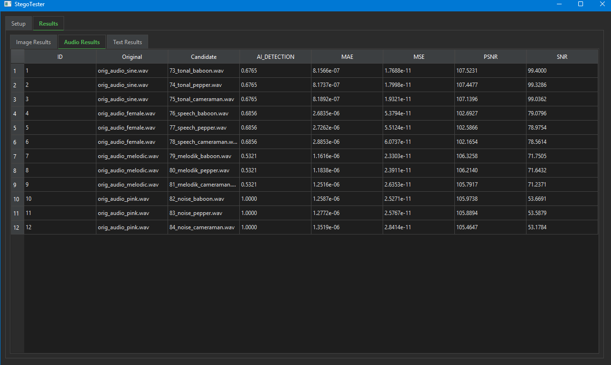
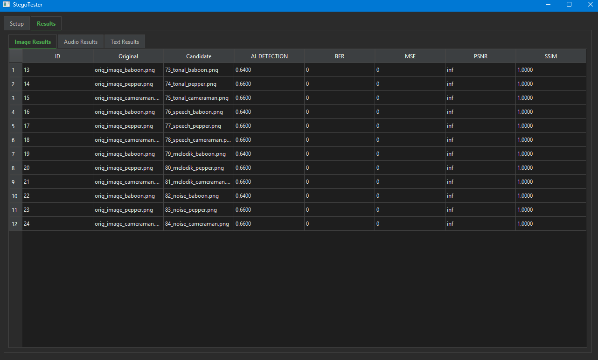

# 🕵️‍♂️ StegoTester v3.1

> **The Ultimate Steganography Analysis & Detection Tool**
> *Powered by Hybrid AI Architecture (Gatekeeper + Detective)*


**StegoTester** is a professional-grade forensic tool designed to detect hidden data within digital media and benchmark steganography algorithms.

Unlike traditional tools that rely solely on simple math, **StegoTester v3.1** employs a **Hybrid Detection Engine** that combines rigorous statistical analysis with trained Machine Learning models.

> 🧠 **AI Training Module:** The source code for model training, dataset generation, and feature extraction used in this project can be found in the [StegoTester-AI-Training](https://github.com/umitkrkmz/StegoTester-AI-Training) repository.

---

## 🚀 New in v3.1: The Hybrid Engine

This version introduces a revolutionary detection architecture:

### 1. 🛡️ The Gatekeeper (Audio)
A zero-latency mathematical guard for audio files.
* Calculates the `LSB Transition Rate` instantly.
* If the rate exceeds the **0.455** threshold, it flags the file as **CRITICAL STEGO** immediately, bypassing the AI for maximum speed.
* *Result:* 99.9% accuracy on standard LSB attacks.

### 2. 🕵️‍♂️ The Detective (AI Models)
Files that pass the Gatekeeper (complex audio) and all images are sent to our trained Machine Learning models (Random Forest / Gradient Boosting).
* **Analyzed Features:** `Entropy`, `Edge Density`, `MFCC`, `Spectral Flatness`, `LSB Correlation`.
* *Result:* Detects subtle anomalies (like Echo Hiding or Texture Masking) that human senses miss.

---

## 📸 Screenshots

### Audio Analysis & AI Detection
*The Gatekeeper in action: Detecting LSB noise with 1.0 confidence, while analyzing complex Stego attacks.*


### Image Analysis Metrics
*Comprehensive breakdown of MSE, PSNR, and SSIM metrics alongside AI probability scores.*


---

## 🛠 Features

### 📊 Comprehensive Metrics
Benchmarking standards for academic and forensic use:
* **Image:** MSE, PSNR, SSIM, LPIPS (Perceptual).
* **Audio:** SNR, LSD (Log-Spectral Distance), MAE.
* **Payload:** BER (Bit Error Rate) verification for extracted data.

### 🧠 Smart Matching
Automatically pairs Original and Candidate files using **pHash** (Images) and **Spectral Fingerprinting** (Audio). No need to rename files manually!

### 🖥️ Modern Reporting
* **Visual Comparison:** Interactive "Before/After" slider.
* **PDF Exports:** Professional reports with Executive Summaries, Risk Pie Charts, and detailed findings.

---

## 📉 Interpreting AI Scores

The `AI_DETECTION` metric represents the probability (0.0 - 1.0) of a file containing hidden data.

| Score Range | Verdict | Explanation |
| :--- | :--- | :--- |
| **0.00 - 0.50** | 🟢 **SAFE** | File appears clean. |
| **0.50 - 0.80** | 🟠 **SUSPICIOUS** | High complexity or noise detected. Could be a subtle stego attack OR a naturally complex file (e.g., highly textured image). |
| **0.80 - 1.00** | 🔴 **CRITICAL** | Strong statistical evidence of tampering. Almost certainly contains hidden data. |

---

## 📦 Installation & Setup

1.  **Clone the Repository:**
    ```bash
    git clone https://github.com/umitkrkmz/stegotester.git
    cd stegotester
    ```

2.  **Install Dependencies:**
    ```bash
    pip install -r requirements.txt
    ```
    *(Note: Libraries like Librosa and Torch may take a moment to install)*

3.  **Model Check:**
    Ensure trained models are present in the `models/` directory:
    * `models/stego_model_image.pkl`
    * `models/stego_model_audio.pkl`

    > *Note: Visit the [StegoTester-AI-Training](https://github.com/umitkrkmz/StegoTester-AI-Training) repo to see how these models were trained.*

4.  **Run the Application:**
    ```bash
    python main.py
    ```

---

## 📜 License

Distributed under the MIT License. See `LICENSE` for more information.