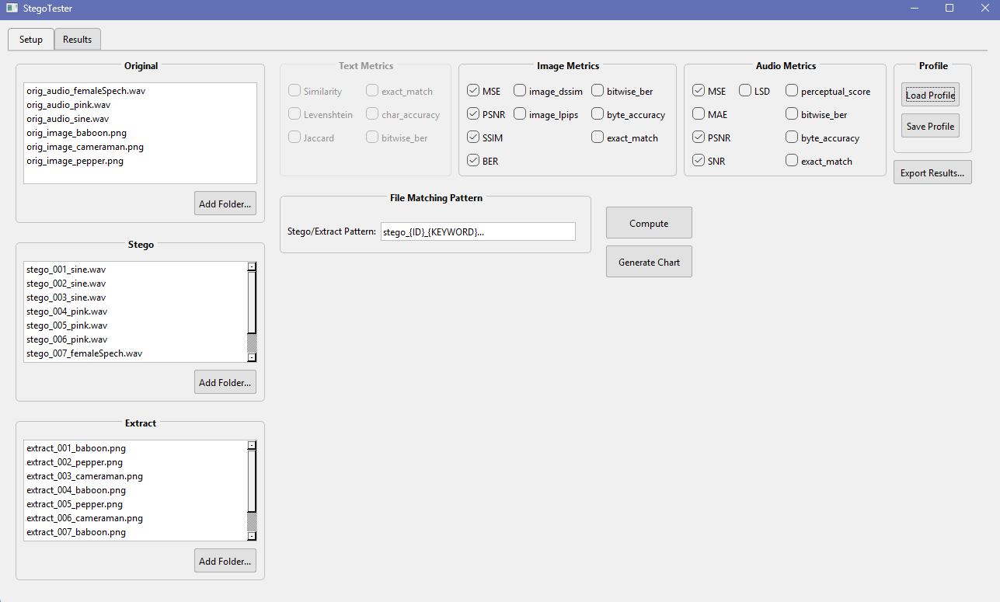
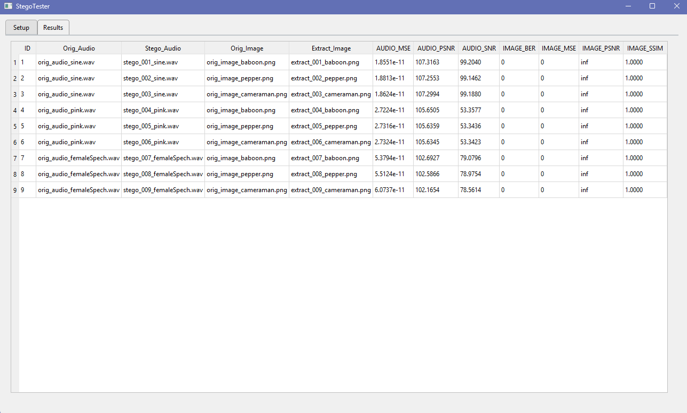
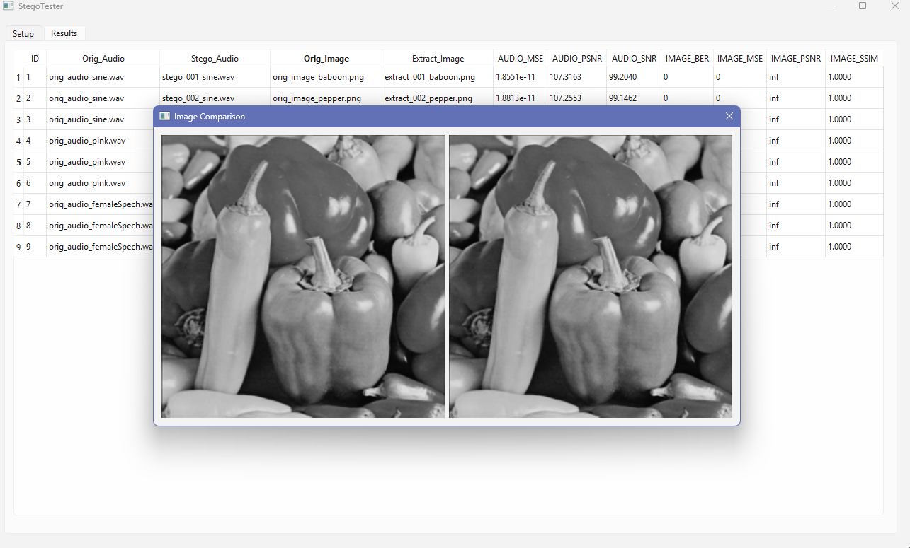

# StegoTester v2.0

**An Advanced, GUI-Based Analysis and Reporting Tool for Steganography**

[](https://www.python.org/)
[](https://www.qt.io/qt-for-python)
[](https://opensource.org/licenses/MIT)

StegoTester is a comprehensive desktop application designed for researchers, students, and developers aiming to measure and analyze the performance of steganography algorithms. With a completely redesigned user interface and a powerful backend, StegoTester allows you to seamlessly evaluate embedding quality and data recovery success across image, audio, and text files.



## Key Features

- **Unified Workflow**: Process a single file or entire folders of files using the same intuitive interface. Supports both drag-and-drop and folder selection.
- **Flexible File Matching**: Move beyond rigid naming conventions. A powerful pattern matching engine allows you to define your own file naming rules using simple tags like `{ID}` and `{KEYWORD}`.
- **Tabbed Interface**: A clean, organized user interface with dedicated tabs for `Setup` and `Results` to provide a focused and efficient workspace.
- **Expanded File Support**: Now includes support for lossless `.flac` audio files in addition to other formats.
- **Extensive Metrics Library**: A rich set of objective and perceptual metrics for a deep analysis.
  - **Image**: MSE, PSNR, SSIM, LPIPS, BER, and more.
  - **Audio**: MSE, PSNR, SNR, LSD, Perceptual Score, and more.
  - **Text**: Levenshtein Distance, Jaccard Similarity, Char Accuracy, and more.
- **Advanced Reporting**: Export your analysis in multiple formats:
  - **Data-Friendly (JSON, CSV)**: For easy integration with scripts and other analysis tools.
  - **Human-Readable (TXT, PDF)**: Generate clean text summaries or professional, multi-page PDF reports with embedded charts for visual analysis.
- **Interactive Tools**:
  - **Chart Visualization**: Generate dynamic `matplotlib` charts from your results in a separate dialog window.
  - **Context Menus**: Right-click on any result to open the file location, compare images side-by-side, or listen to audio files.
  - **Metric Profiles**: Save and load your favorite metric combinations to speed up repetitive tasks.
- **Responsive & Non-Blocking**: All heavy tasks (metric calculation, report generation) run in the background, ensuring the UI is always responsive.

## Screenshots

<table>
  <tr>
    <td></td>
    <td></td>
  </tr>
  <tr>
    <td align="center"><i>Spacious Results Table</i></td>
    <td align="center"><i>Dynamic Charting Window</i></td>
  </tr>
</table>

## Getting Started

### Prerequisites

- **Python 3.11+**

### Installation

The project uses a `requirements.txt` file for easy setup.

1.  **Create and activate a virtual environment (Recommended):**
    ```bash
    python -m venv .venv
    # Windows: .venv\Scripts\activate
    # Linux/macOS: source .venv/bin/activate
    ```

2.  **Install All Dependencies:**
    Install using the `requirements.txt` file, which contains the full list of libraries for all features.
    ```bash
    pip install -r requirements.txt
    ```

### Running the Application

Once the dependencies are installed, run the application from the project's root directory:
```bash
python main.py
```

## Workflow Guide

1.  **Load Files**: Drag and drop your files into the lists, or use the **"Add Folder..."** buttons to load files in bulk.
2.  **Set Matching Pattern**: If your files don't follow the default naming convention, enter your custom pattern in the **"File Matching Pattern"** text box. See the guide below for examples.
3.  **Select Metrics**: Choose the metrics you want to calculate. Use the **"Save/Load Profile"** buttons to manage your selections.
4.  **Compute**: Click **"Compute"**. The results will automatically appear in the **"Results"** tab.
5.  **Visualize & Analyze**: Click **"Generate Chart"** to open the visualization window. Right-click on rows in the Results table for more actions.
6.  **Export**: Click **"Export Results..."** and choose your desired format (PDF, TXT, CSV, or JSON) in the save dialog.

## Flexible File Naming Guide

StegoTester's pattern engine uses special tags to find the `ID` and `KEYWORD` in your filenames.

-   **`{ID}`**: Represents the numeric ID of the test group.
-   **`{KEYWORD}`**: Represents the keyword linking to an original file.
-   **`...`**: A wildcard that matches any characters.

**Example Scenarios:**

| Filename Example                      | Pattern to Enter in the UI        |
| ------------------------------------- | --------------------------------- |
| `stego_001_lsb_sine.wav`              | `stego_{ID}_..._{KEYWORD}...`     |
| `Test-sine-1.flac`                    | `Test-{KEYWORD}-{ID}...`          |
| `output_id_42_payload_secret.png`     | `..._id_{ID}_...`                 |

## Technologies Used

- **UI Framework**: PySide6
- **Charting**: Matplotlib
- **PDF Reporting**: FPDF (pyfpdf)
- **Core Metrics**: NumPy, SciPy, Scikit-Image
- **Audio Processing**: SoundFile
- **Custom Backend**: StegoBench (local module for all metric calculations)

## License

This project is licensed under the **MIT License**. See the [LICENSE](LICENSE) file for details.