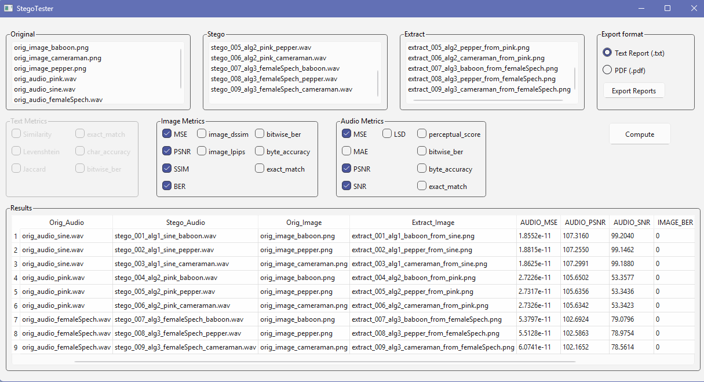

# StegoTester

**Advanced GUI-Based Analysis and Reporting Tool for Steganography**

[](https://www.python.org/downloads/)
[](https://opensource.org/licenses/MIT)

StegoTester is a desktop application designed for researchers, students, and developers who want to measure the performance of steganography algorithms with objective metrics. It allows you to easily analyze the quality of embedding processes and the success of data recovery in audio, image, and text files.



---

## Features

- **Versatile File Support**: Supports popular **Image**, **Audio**, and **Text** formats such as `PNG`, `JPG`, `WAV`, and `TXT`.
- **Drag-and-Drop Interface**: Easily drag and drop your Original, Stego, and Extract files into the corresponding lists.
- **Extensive Metrics Library**:
  - **Image Metrics**: MSE, PSNR, SSIM, BER, LPIPS, and more.
  - **Audio Metrics**: MSE, PSNR, SNR, LSD, Perceptual Score, and more.
  - **Text Metrics**: Levenshtein Distance, Jaccard Similarity, Char Accuracy, and more.
- **Dynamic UI**: Only the metric groups relevant to the loaded file types are automatically enabled, preventing confusion.
- **Real-time Results Table**: View all calculated metrics directly within the application in a dynamic and organized table.
- **Professional Reporting**: Export your analysis results in two different formats:
  - **TXT Report**: A clean, aligned text table containing all results.
  - **PDF Report**: A stylish and readable report, arranged vertically for each test (ID).
- **Responsive UI:** Long calculations run in the background without freezing the application, with a progress bar showing the current status.
- **Metric Profiles**: Save your favorite combinations of metrics to a profile file and load them back instantly to speed up repetitive workflows.
- **Interactive Results**: Right-click on any row in the results table to quickly open the file location, visually compare images, or listen to audio files.


---

## Usage

Follow the steps below to take full advantage of the application.

### Step 1: File Naming Convention (Crucial Step!)

You must follow a specific naming standard for the application to correctly match the files.

#### **Original Files**
These are the reference files that form the basis of the comparison.
- **Format:** `orig_type_keyword.extension`.
- **Examples:**
  - `orig_image_baboon.png` (Keyword: `baboon`).
  - `orig_audio_sine.wav` (Keyword: `sine`).

#### **Stego Files**
These are the cover files in which data has been hidden.
- **Format:** `stego_ID_..._keyword_....extension`.
- **Example:** `stego_001_lsb_sine.wav`.
  - `001`: The ID that specifies the test group.
  - `sine`: Indicates that it should be compared with `orig_audio_sine.wav`.

#### **Extract Files**
This is the secret data recovered from the stego file.
- **Format:** `extract_ID_..._keyword_....extension`.
- **Example:** `extract_001_lsb_baboon_from_sine.png`.
  - `001`: Indicates it belongs to the same test group as `stego_001_...`.
  - `baboon`: Indicates that it should be compared with `orig_image_baboon.png`.

### Step 2: Running the Application

1.  Drag and drop your prepared files into the **Original**, **Stego**, and **Extract** lists in the program.
2.  Select the metrics you want to calculate from the activated metric groups.
3.  Click the **"Compute"** button and wait for the calculation to finish.
4.  Review the results in the **"Results"** table below.
5.  Select TXT or PDF from the **"Export format"** section in the upper right and save your report with the **"Export Reports"** button.

---

## Sample Reports

You can examine the report formats generated by the application by clicking the links below:

- **[Sample TXT Report](assets/metrics_20250824_161602.txt)** - All results in a wide, aligned table format.
- **[Sample PDF Report](assets/metrics_20250824_162034.pdf)** - A clean and readable format, arranged vertically for each test ID.

---

## Installation

Python 3.10 or higher is recommended to run the application. The project offers two different installation options based on your needs.

### Option 1: Core Installation (Lightweight & Fast)

This installation includes the essential libraries required to run the most common objective metrics (MSE, PSNR, SSIM, SNR, Levenshtein, etc.). It **does not** include heavy deep learning libraries.

1.  **Create and Activate a Virtual Environment (Recommended):**
    ```bash
    python -m venv .venv
    # Windows: .venv\Scripts\activate | Linux/macOS: source .venv/bin/activate
    ```

2.  **Install Core Dependencies:**
    Copy and run the following command in your terminal to install the necessary libraries:
    ```bash
    pip install PySide6 fpdf matplotlib numpy scikit-image scipy Levenshtein RapidFuzz
    ```

3.  **Run the Application:**
    ```bash
    python main.py
    ```
    *Note: With this setup, if you select metrics like `perceptual_score` (audio) or `lpips` (image), the program will skip them without errors.*


### Option 2: Full Installation (All Metrics)

This installation includes all libraries, including large ones like `torch`, enabling **all metrics** in the project to work (including perceptual audio and image metrics).

1.  **Create and Activate a Virtual Environment** (if you haven't already).

2.  **Install All Dependencies:**
    Install using the `requirements.txt` file, which is located in the main project directory and contains the full list of libraries.
    ```bash
    pip install -r requirements.txt
    ```

3.  **Run the Application:**
    ```bash
    python main.py
    ```

---

## Technologies Used

- **PySide6**: UI design and application framework.
- **StegoBench (Custom Local Module)**: Handles the calculation of all steganography metrics.
- **FPDF**: Creation of PDF reports.

## License

This project is licensed under the **MIT License**. See the [LICENSE](LICENSE) file for details.